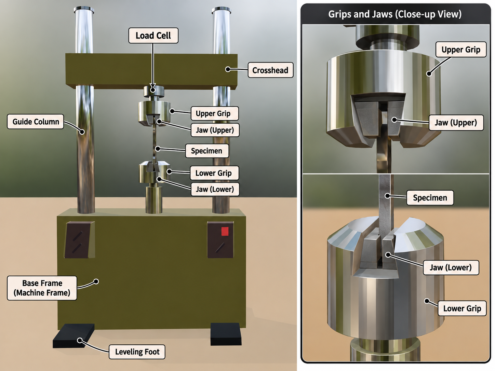
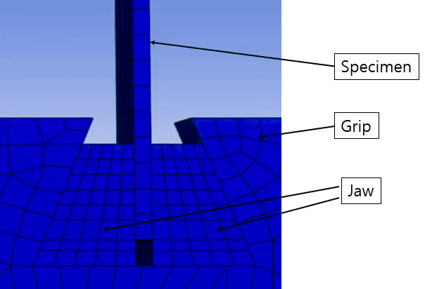
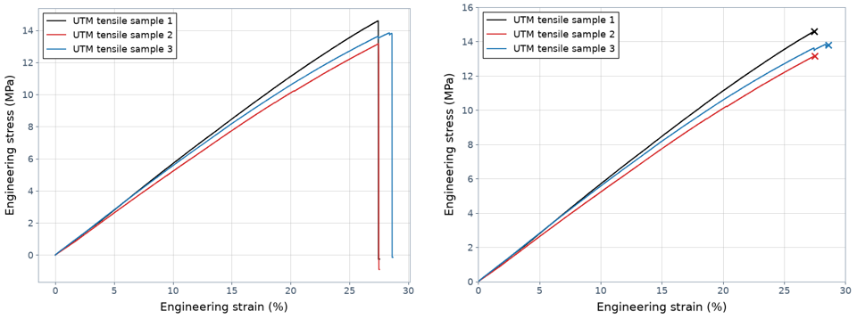
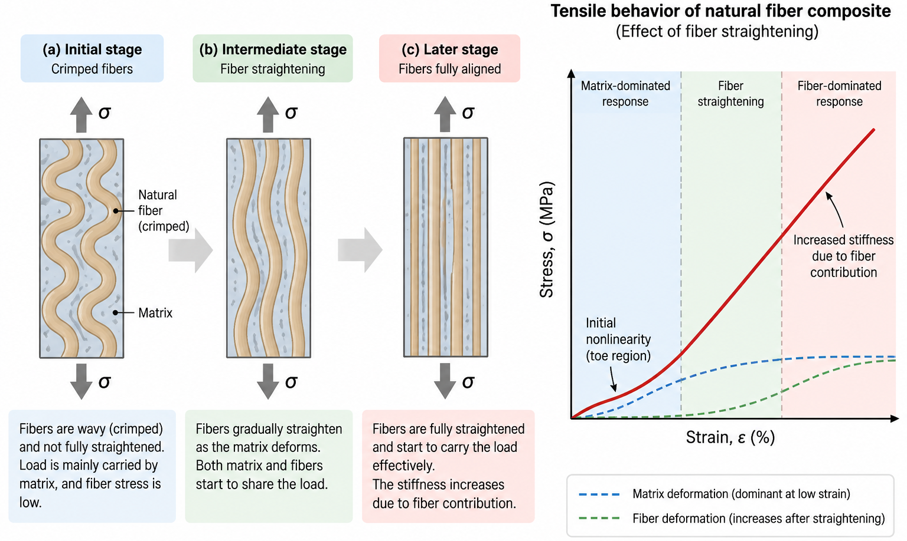

A tensile test is one of the most fundamental materials tests. It measures load and deformation while a tensile load is applied along the axis of a specimen. This article summarizes, based on practical experience, the preparation, data conversion, result interpretation, and common error checks for a typical test using a universal testing machine and an extensometer.

## 1. Overview of Tensile Testing

In a tensile test, a specimen with a prescribed geometry is pulled at a constant speed while the load and displacement or extension are recorded. Using this data and the specimen's initial dimensions, several representative mechanical properties can be obtained.

- **Elastic modulus (Young's modulus)**: The ratio of the increase in stress to the increase in strain in the elastic region, representing the stiffness of a material.
- **Tensile strength**: The maximum engineering stress sustained by the specimen during the test.
- **Yield strength or yield point**: The stress at which the material leaves elastic behavior and permanent deformation begins. For materials without a distinct yield point, the offset yield strength specified by the relevant standard may be used.
- **Elongation at break**: The strain at fracture or the increase in length relative to the initial gauge length.
- **Poisson's ratio**: The negative ratio of transverse strain to axial strain. Measuring it usually requires a transverse extensometer, strain gauges, or an optical measurement system.

A stress-strain curve represents the stress applied to a material and its corresponding relative change in length. Engineering stress and engineering strain are generally calculated as follows.

$$
\sigma = \frac{F}{A_0}
$$

$$
\varepsilon = \frac{\Delta L}{L_0}
$$

Here, $F$ is the load, $A_0$ is the initial cross-sectional area, $\Delta L$ is the change in gauge length, and $L_0$ is the initial gauge length. Stress is usually expressed in MPa, while strain is expressed as a dimensionless value or as a percentage.

A load-displacement curve includes not only the specimen dimensions but also deformation of the testing machine and grips, so it can vary with specimen geometry and equipment conditions even for the same material. A stress-strain curve, in contrast, is normalized by the initial cross-sectional area and gauge length and is therefore more suitable for comparing material behavior.

The shape of the curve depends on the material. Metals often show yielding and plastic deformation after a linear elastic region. Polymers can be strongly affected by viscoelasticity, test speed, and temperature. Fiber-reinforced composites may behave almost linearly until fracture in the fiber direction, while their behavior can become nonlinear or show stepwise load drops depending on the laminate direction and damage mechanism.

In the interactive graph below, change Young's modulus, yield strength, tensile strength, and failure strain, or select a representative material to observe how the stress-strain curve changes.

<!-- interactive:tensile-test -->

*For a wider view in which the curve can be adjusted, use the [stress-strain curve interactive demo](/en/interactive/stress-strain-demo/).*

## 2. Structure and Principles of a Tensile Testing Machine

A universal testing machine (UTM) applies a controlled load or displacement to a specimen and records its response. A typical machine consists of the following elements.

*Figure 1. Example of a tensile-testing setup using a universal testing machine (UTM). The extensometer, data acquisition system, and computer are omitted. (Modeling: Blender)*

| Component | Function |
| --- | --- |
| Load cell | Converts the tensile force transmitted to the specimen into an electrical signal. Its capacity should suit the specimens being tested. An excessively large capacity can make the graph coarse because of limited resolution, while an excessively small capacity greatly increases the risk of damaging the load cell. |
| Crosshead | Moves under the drive mechanism and applies displacement to the specimen. Test speed is commonly expressed as crosshead speed. |
| Grip or fixture | Holds both ends of the specimen and transmits the load. |
| Specimen | The test object manufactured according to the applicable standard. |
| Extensometer | Measures the actual extension over a defined gauge length. |
| Data acquisition system | Synchronizes and stores signals such as load, position, and extension over time. It usually consists of a main unit, controller or data acquisition hardware (DAQ), and computer. |
| Jaw | The element inside the grip that contacts the specimen directly. Its contact surface is usually knurled to reduce slipping. Because jaws are often wedge-shaped, they grip more tightly as tension increases; gripping too tightly at the start can cause compressive failure in the specimen's grip section. |

When a test starts, the controller moves the crosshead at the configured speed. The load cell measures the axial force, while a crosshead position sensor or encoder records the travel. If an extensometer is installed, extension over the gauge length is collected through a separate channel.

Crosshead displacement is not the deformation of the specimen alone. It may include elastic deformation of the machine frame, load train, grips, and tabs, as well as slipping inside the grips and initial slack. Therefore, using crosshead displacement directly as specimen strain can introduce significant error, especially when calculating quantities sensitive to the initial slope, such as the elastic modulus.

### Extensometer

An extensometer places two contact points on a specimen and directly measures the change in distance between them. The initial distance between the two points is the gauge length, and strain is calculated by dividing the measured extension by this distance. Because an extensometer measures deformation in the specimen gauge section more directly than the deformation of the entire machine, it is useful for obtaining a more accurate elastic modulus and yield strain than crosshead displacement can provide.

For example, if the initial distance between two contact points is 25 mm and the points move 2 mm apart during tension, the strain at that moment is calculated as $2/25$. This is more accurate than dividing crosshead travel by the specimen gauge length.

*Names of the parts of an extensometer. The key is to use it so that the knife edges accurately follow the specimen surface.*

An extensometer uses knife edges at a fixed spacing, as shown in the figure, and measures deformation while they remain in contact with the specimen. If the knife edges slip during the test, the data becomes unusable. Although not shown in the figure, the extensometer also includes rings, hooks, or similar parts that allow it to be attached to the specimen.

Without an extensometer, crosshead displacement is affected by countless factors. For example, the crosshead can bend slightly under load during a tensile test, and the guide columns can be compressed slightly. Therefore, obtaining precise strain requires more than the main-body data: an extensometer, strain gauges, a displacement-measuring camera, or other equipment should be used.

Careful use of the extensometer is important. Poor installation can be worse than not using one at all. Although a tensile test is one of the simplest tests, accurate data requires observation and attention at every stage. Check the following when installing an extensometer precisely.

- Mount it symmetrically on the left and right, aligned with the specimen center and gauge section.
- Check that the contact edges or retaining bands do not damage the specimen or slip. Slipping is common during testing, so if the two surfaces have different roughness, as often happens with molded composite materials, contact the rougher surface with the knife edges.
- Confirm that the measurement range and allowable strain are sufficiently large for the expected deformation.
- Set the zero after installation, once the signal has stabilized.
- When removing it, stop the load or follow the specified procedure so that neither the specimen nor the extensometer receives an impact.
- If the specimen is small or weak, the mounted extensometer itself can apply a moment and distort the data. In that case, a separate measure to offset the effect of the extensometer's weight is recommended. *(There is no special trick to it.)*

Keeping an extensometer in place until fracture allows direct measurement of fracture strain, but the fracture impact can damage it. Suppose, for example, that a product must not open more than 40 mm between its knife edges. If the specimen breaks and the gap exceeds that value, the internal sensor can be damaged. Depending on the test standard, the extensometer travel, and the fracture behavior, it may be removed after measuring up to a specified strain and the later deformation measured by another method. Digital Image Correlation (DIC) equipment is also increasingly used as camera performance continues to improve.

### Jaw

Jaws are mounted inside the grips, and suitable jaws can be selected according to the specimen geometry and thickness. One of their main features is their wedge-shaped mounting in the grip. During a tensile test, the specimen pulls the jaw toward itself. On close observation, the jaw is being pulled toward a narrower part of the grip, which increases the compressive load on the specimen's contact surface. It is therefore unnecessary to clamp the specimen with excessive force from the beginning.

The following figure uses structural analysis to visualize the stress and deformation behavior that develops in a jaw under tension.

*On close observation, the jaw can be seen climbing along the grip surface; the specimen is subjected to increasing compression as this happens.*

#### Machine Precision and Reliability

Reliable test results depend not only on the accuracy of load and displacement measurements but also on the mechanical quality of the testing machine. Frame stiffness and alignment can directly affect the result. In particular, poor load-train alignment can create unintended bending stress in the specimen and introduce error. Precision materials-testing machines are therefore designed and manufactured to provide sufficient frame stiffness while maintaining a high level of alignment among the actuator, grips, specimen, and load cell. I do not remember the details precisely from what I heard from an industry professional, but precision is classified into classes and controlled to a very high level; even turning some screws can affect the result, so they should not be adjusted casually.

For tests requiring high reliability, it is therefore preferable to use equipment from a manufacturer with sufficient experience and technical expertise in materials-testing machines and control systems, rather than comparing only maximum load capacity or displayed resolution. It is also important that the load cell, displacement transducer, extensometer, controller, and data acquisition system operate reliably together as one system.

The performance difference between equipment and control systems can be even more important in complex dynamic tests, such as fatigue tests, than in static tensile tests. Dynamic testing simultaneously requires accurate load control, response speed, waveform maintenance, sensor integration, and real-time data processing.

For example, in a fatigue crack growth test, crack length can be measured directly with optical equipment such as a traveling microscope. A properly calibrated high-precision system may also provide an option to calculate crack length indirectly from the relationship between compliance measured with COD (Crack Opening Displacement) or a crack-opening displacement gauge and crack length. This makes it possible to track crack growth continuously during cyclic loading and connect it with test control and data processing, improving convenience and automation.

When selecting a materials-testing machine, it is therefore desirable to consider frame stiffness, load-train alignment, sensor accuracy, control performance, the data acquisition system, and future extensibility for planned test methods, rather than only load capacity or static accuracy.

## 3. Analysis of Tensile-Test Data

Raw data usually consists of time, load, crosshead displacement, and extensometer extension. The basic process for creating a stress-strain curve is as follows.

1. Calculate the initial cross-sectional area $A_0$ from the width and thickness measured before testing.
2. Divide the load $F$ by $A_0$ to convert it to engineering stress $\sigma$.
3. Divide the extensometer extension $\Delta L$ by the initial gauge length $L_0$ to convert it to engineering strain $\varepsilon$.
   *In most spreadsheets, calculate only the first row and then fill the formula down automatically.*
4. When needed, calculate the elastic modulus, yield strength, tensile strength, and fracture strain using the interval and method specified by the relevant standard.

For example, if a rectangular specimen 10 mm wide and 2 mm thick is subjected to a 10 kN load, its initial cross-sectional area is 20 mm² and its engineering stress is:

$$
\sigma = \frac{10\,000\ \mathrm{N}}{20\ \mathrm{mm^2}} = 500\ \mathrm{MPa}
$$

If a 50 mm gauge section increases in length by 0.25 mm, the engineering strain is $0.25/50=0.005$, or 0.5%. Incorrectly measuring the width or thickness introduces a proportional error into every stress value, while an incorrect gauge length changes every strain value. The dimensions of each specimen should be measured and recorded directly.

The elastic modulus is calculated from the slope of the elastic region.

$$
E = \frac{\Delta \sigma}{\Delta \varepsilon}
$$

Rather than fitting a line arbitrarily from the beginning of the curve, use the strain interval specified by the applicable test standard. The initial part may include a toe region caused by specimen seating or the removal of slack.

Tensile strength is the maximum engineering stress. Fracture strain is obtained from a valid strain signal at fracture or by measuring the gauge length after the test; its definition and measurement method can vary by standard. For yield strength, select an appropriate criterion such as the yield point or an offset method depending on whether a clear yield point exists.

Smoothing, shifting the starting point, or removing outliers should be applied sparingly while preserving the original data. Excessive filtering can erase actual yielding, minor damage, or a load drop before fracture. When correction is needed, record its purpose, algorithm, parameters, and the data before and after processing together.

#### Processing a Test Graph

People draw graphs in different ways, and there is no single universally fixed procedure. However, using a graph immediately after generating it with the default options is not recommended.

The image on the left below shows a graph immediately after calculating stress and strain. The y-axis does not end at a round number, and the origin is not at the lower-left corner. Also, because the load-cell value becomes zero immediately after fracture, connecting that point in the graph creates a vertical line.

The graph on the right has been cleaned up. The line dropping to zero after the fracture point was removed, and the fracture point was marked with an x.

Composite materials, however, can fracture in steps after initial crack initiation. In such cases, the vertical drops should not be removed carelessly because the fracture behavior needs to be preserved.

*Stress-strain curve immediately after plotting (left) and after cleanup (right). Because the material is highly brittle, its slope increases almost constantly.*

#### Example of a Toe Region

Fortunately, the example graph above did not develop a toe region, but toe regions occur in many tests. Ignoring them during data processing can increase error or produce an incorrect elastic modulus.

Toe regions have many causes, including:
- Grip defects, such as clearance between the grip and jaw, slipping, or the grip force loosening immediately after the tensile test begins.
  *This is a problem I have encountered frequently and believe is likely to be common.*
- Initial specimen and grip settling or alignment
- Testing-machine compliance
- Specimen defects, such as fibers rearranging internally at the beginning of a composite-material test

A toe region is not always a testing error. In the last example, it may be an inherent behavior of the material.

#### Unusual Tensile Behavior by Material

If you are familiar only with stress-strain curves for ordinary metals or brittle materials, it is easy to mistake the irregular curves of composites for testing errors or noise. However, curve shapes can vary greatly with the material structure and failure mechanism. Before processing the data, determine whether the behavior comes from a testing problem or from the actual deformation and damage mechanism of the material.

**Fiber-Reinforced Composites**

Fiber-reinforced composites (FRP) can show more complex failure behavior than a single material because they consist of fibers, a matrix, and interfaces. Matrix cracking, fiber/matrix debonding, delamination, and fiber breakage may occur sequentially or simultaneously during a tensile test.

In a laminated composite, the first damage event does not necessarily mean that the entire specimen fractures immediately. After some layers or fiber bundles fail, the remaining material can continue carrying load as the load is redistributed. Repetition of this process can produce **stepwise or sawtooth failure behavior** in the stress-strain curve, where the load momentarily decreases and then rises again.

For this reason, a load drop after the maximum load or a small intermediate drop should not be dismissed as noise and deleted or excessively smoothed. Doing so can erase the actual damage process.

**Woven and Natural-Fiber Composites**

In woven composites and natural-fiber composites, fiber or fiber-bundle alignment, reduction of crimp, and slight interfacial slip may occur at the beginning of tension. The initial stress-strain curve may therefore not be perfectly straight, or its slope may gradually increase.

This initial nonlinearity can resemble a toe region caused by grip clearance or specimen slipping. However, if a similar shape appears in repeated tests and there is no problem with the equipment or grips, the possibility that it is structural behavior inherent to the material should be considered.

*In general, the fibers and matrix deform together in a fiber-reinforced composite, but the fibers, which have a higher elastic modulus, carry a relatively large portion of the stress. When natural fibers or fiber bundles are initially curved or not fully aligned, they cannot effectively carry axial load. At first, therefore, the fibers gradually align with the load direction as their curvature decreases with increasing tensile strain. Once they are straightened, the fibers begin to carry load in earnest. The effective stiffness of the composite can increase during this process, producing an initial nonlinear region in the stress-strain curve. This region should not automatically be treated as an invalid result simply because it resembles a toe region.*

**Fiber-Metal Laminates (FMLs)**

A fiber-metal laminate alternates metal layers and fiber-reinforced composite layers, so the deformation and failure characteristics of each constituent can appear together in the overall stress-strain curve. Its tensile behavior is consequently more complex than that of a conventional FRP.

For example, the metal layers may yield first while the composite layers continue to carry load. As deformation increases, metal strain hardening, damage in the composite layers, and final fracture may occur sequentially. Unlike a single metal material, the curve may therefore change slope in multiple stages or show **two or more distinct quasi-linear regions**.

In some cases, the stress-strain curve may contain regions that look like two elastic regions, but they should not all be interpreted as elastic regions in the strict sense. Metal-layer yielding or damage to the interfaces and composite layers may already have begun after the first linear region. The physical meaning of each region should therefore be interpreted together with the properties of the constituents and observations of failure.

**Elastomers and Highly Ductile Polymers**

Rubber and some polymeric materials behave very differently from ordinary linear-elastic materials that assume small strains. Strong nonlinearity may appear from the beginning, and after yielding, strain hardening may occur as necking and molecular-chain orientation increase the stress again.

For materials undergoing large deformation, the difference between engineering stress-engineering strain and true stress-true strain becomes significant. Their curves should therefore not be interpreted in exactly the same way as those of metals or ordinary fiber-reinforced composites.

---

As these examples show, **nonlinearity, slope changes, momentary load drops, and stepwise failure in a stress-strain curve do not necessarily indicate data errors.** During data processing, it is more important to determine whether a feature arose from the testing equipment or from the material's actual deformation and damage mechanisms than simply to make the graph look smooth.

## 4. Points to Watch During Tensile Testing

Before testing, check the load-cell capacity and calibration status, grip type, test speed, data acquisition rate, specimen dimensions, and extensometer range. Install the specimen so that it is aligned with the load axis, and keep the gripping length and pressure consistent on both sides. Apply the preload and zeroing sequence consistently to every specimen according to the test standard and equipment procedure.

### Representative Abnormal Curves and How to Check Them

| Observed behavior | Possible cause | Checks and response |
| --- | --- | --- |
| A gradual or curved slack/toe region appears at the beginning of the curve | Clearance in the specimen or load train, low initial tension, or seating in the grips | Check the initial load and zeroing sequence and inspect clearance in the grips and connections. Apply toe correction only when permitted by the standard. |
| Load increases, but strain suddenly increases substantially | Specimen slipping or movement of the extensometer contact points | Mark the specimen and grips to check relative movement, then adjust the grip surface and pressure. Also check extensometer attachment. |
| The initial slope is lower than expected | Crosshead displacement used as strain, poor extensometer installation, machine compliance, or bending | Check the strain channel and gauge-length input. Reinstall the extensometer and inspect specimen alignment and equipment connections. |
| The initial slope is abnormally high or strain barely increases | Extensometer jam, incorrect strain range or units, or poor contact | Check free extensometer movement and calibration, and review the channel scale, units, and gauge-length settings. |
| Stress or strain signals spike momentarily or contain substantial noise | Electrical noise, loose cables, poor data quality, or stepwise specimen or tab damage | Check sensor cables and grounding and review the raw time history. Determine whether the signal repeats or agrees with actual damage sounds or visible changes. |
| The curve repeatedly bends or the load decreases in steps | Progressive composite damage, tab separation, slipping, or a sensor problem | Photograph and observe the specimen surface and tabs, then compare the timing of load, strain, and video events. Distinguish actual damage from measurement error. |
| Fracture occurs at the grip or tab rather than in the gauge section | Stress concentration, poor alignment, excessive grip pressure, or tab geometry or bonding defects | Record the fracture location and appearance and check grip length, tab condition, edge damage, and alignment. Apply the valid-fracture criteria in the standard. |
| Stress values vary excessively among specimens tested under the same conditions | Width or thickness measurement error, unit-entry error, material variation, or differences in load transfer | Compare raw load separately from the entered cross-sectional area and recheck measurement locations, instruments, and specimen orientation. |
| The curve is smooth but completely unlike the expected material behavior | Wrong sensor channel, units, or specimen information; different test speed or temperature; or incorrect specimen orientation | Compare equipment settings and file metadata with the original test record and check test speed, environment, and specimen orientation. |

If grip pressure is too low, the specimen slips. If it is too high, the specimen surface or composite tab can be damaged and cause premature fracture near the grip. Poor alignment creates bending together with the tensile load, so when possible, compare strain on both sides or both surfaces of the specimen to assess the amount of bending.

An unexpected curve should not be deleted immediately. Preserve the raw data and fractured specimen, and first check the fracture location, signs of slipping, test settings, sensor signals, and work records. Then record whether the result is excluded and why, based on the validity criteria of the applicable standard.

## 5. Further Topics

Adding the following measurement methods or environmental controls to a basic UTM and extensometer test allows a wider range of mechanical behavior to be analyzed.

- **Strain gauges**: Measure local strain on the specimen surface. Arranging multiple gauges in different directions allows directional deformation to be compared.
- **Poisson's ratio measurement**: Measure axial and transverse strain simultaneously to evaluate contraction perpendicular to the loading direction.
- **Digital Image Correlation (DIC)**: Analyze images of the specimen surface to obtain full-field strain distributions without contact.
- **Cyclic tensile testing**: Observe stiffness changes, residual deformation, and damage accumulation under repeated loading.
- **High- and low-temperature tensile testing**: Use an environmental chamber to evaluate the effects of temperature on strength and deformation behavior.
- **Directional tensile testing of composites**: Compare anisotropy according to fiber direction and laminate configuration.
- **True stress-true strain**: Account for the instantaneous cross-sectional area and length as they change during deformation. It should be distinguished from engineering stress-engineering strain when analyzing large plastic deformation.

Each method has different specimen-preparation, instrumentation, and data-processing requirements, so the relevant test standard and procedure should be reviewed separately for the intended purpose. Detailed discussions of strain gauges, DIC, directional tensile testing of composites, and practical data-analysis methods will be covered in separate documents after additional test cases, figures, and raw data are prepared.
