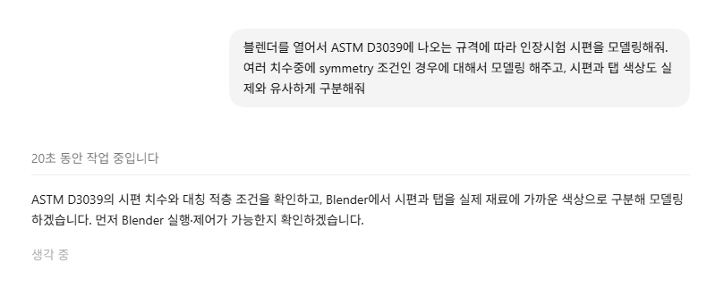
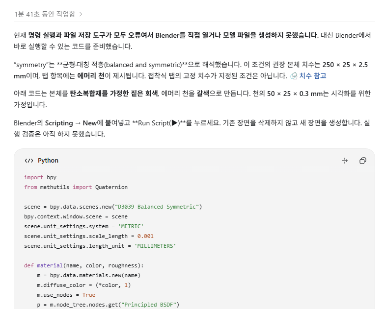
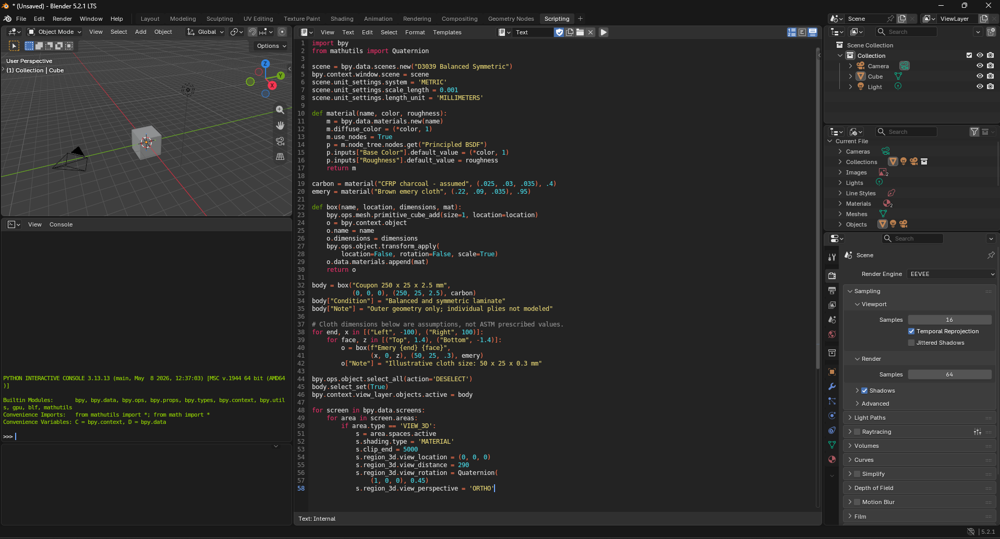
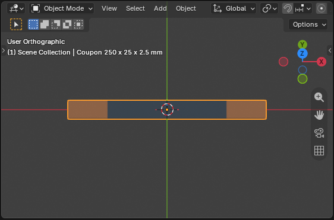
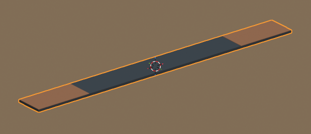
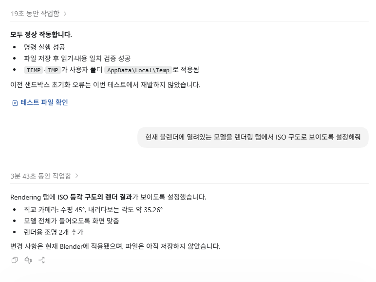
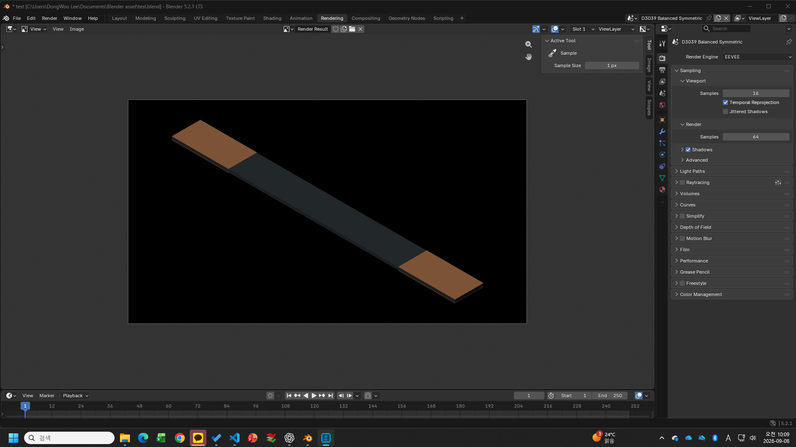
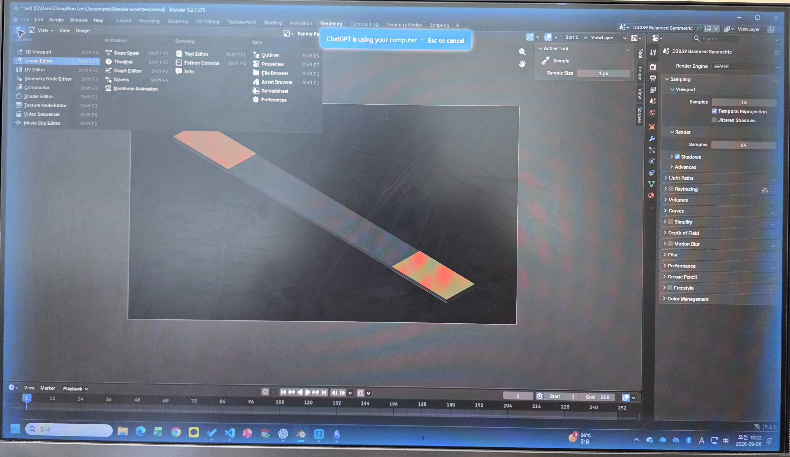
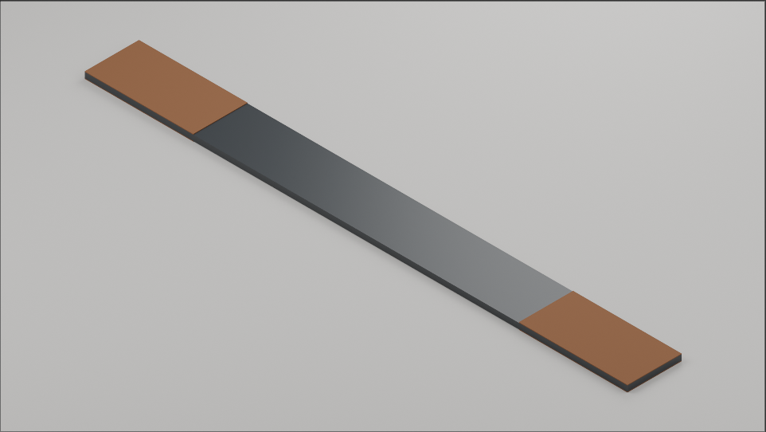

GPT-6 아스트라가 블렌더로 모델링을 할 수 있다고 하는데, 공개된 예시에서는 화려하고 복잡한 결과물이 주로 보였다. 그래서 간단한 모델링도 실제 작업에 활용할 만큼 쉽게 생성할 수 있는지 직접 확인해보기로 했다.

## 직접 모델링 해보기

웹에서는 5.6 Sol만 보였는데, 데스크탑 앱을 설치하니 아스트라의 사용이 가능해서 바로 시도해보았다.
블렌더 최신버전이 설치된 환경에서 GPT앱의 Codex에 아래와 같은 요청을 하였다.

> **Prompt**
>
> 블렌더를 열어서 ASTM D3039 규격에 나오는 인장시험 시편을 모델링 해줘. 여러 치수중에 Symmetry 조건인 경우에 대해서 모델링 해주고, 시편과 탭 색상도 실제와 유사하게 구분해줘.

아래 그림과 같이 코드를 넣고 Run 버튼을 누르면..
좌측 상단의 화면에서 모델이 단계별로 생성되는 것을 볼 수 있다.

생성된 모델을 Shading 탭에서 본 화면. 카메라를 생성하지 않았기 때문에 Modeling 탭에서는 보이지 않는다. 딸깍으로 모든게 되는 세상에서 카메라 위치 잡고 조명 세팅하는 것도 번거로워지기 시작하였다.

## 오류 수정과 추가 요청

처음부터 모든 것이 순조롭게 진행된 것은 아니었다. 코드를 실행하는 과정에서 몇 가지 오류가 발생했고, 오류가 나타날 때마다 아스트라에게 현재 문제를 확인하고 수정해 달라고 요청하였다.

처음에는 오류가 발생할 때마다 직접 코드를 확인해야 하나 싶었지만, 그냥 발생한 문제를 다시 보여주고 고쳐달라고 하는 방식으로 계속 진행해 보았다. 몇 차례 수정과 실행을 반복하니 결국 오류 없이 모델이 정상적으로 생성되었다.

모델이 만들어진 뒤에는 원하는 모습에 조금 더 가깝게 만들기 위한 요청을 이어갔다. Modeling 탭에서 모델을 보기 불편해서 ISO 뷰에서 바로 확인할 수 있게 해달라고 하니 카메라를 새로 만들고 뷰까지 알아서 잡아주었다.

배경과 색감도 조금 어색해서 좀 더 자연스럽게 바꿔달라고 요청하였다. 이때부터는 아스트라가 직접 컴퓨터를 제어하면서 블렌더를 조작하였다. 모니터 가장자리가 파란색으로 바뀌고 마우스 커서가 알아서 움직이는 모습이 꽤 신기했다.

결과적으로 블렌더의 기능이나 코드를 하나하나 찾아가며 수정하기보다는, **문제가 생기면 보여주고 고쳐달라고 하고, 마음에 들지 않는 부분은 다시 요청하는 방식**만으로 최종 렌더링이 가능한 상태까지 만들 수 있었다.

최종 모델링 화면에서는 배경이 검정색이고 색감이 자연스럽지가 않아서 추가 요청을 해보고 싶었다. 그 전에, 초기에 발생했던 오류를 잡기 위하여 수차례 요청을 수행한 결과 오류가 잡혔다.

모델이 생성은 되었지만 Modeling 탭에서 카메라가 없어서 보이지 않기 때문에 우선 ISO 뷰로 Modeling 탭에서 보이게 해달라고 요청하니 스스로 카메라를 생성후 ISO뷰를 만들어 주었다.

그 후, 좀더 배경과 색상 등을 조절해서 좀더 자연스럽게 바꿔달라고 하였다. 아스트라가 직접 컴퓨터를 제어하는데, 이때 모니터 가장자리가 파란색으로 바뀌며 커서도 마음대로 움직인다. 이때 마우스를 움직일수는 있지만 아스트라의 작업을 방해하게 된다.

*GPT가 컴퓨터 제어 중 카메라를 이용한 촬영 화면. 화면 캡쳐로는 파란색 테두리가 나오지 않는다.*

## 최종 결과

최종적으로 바로 렌더링 할 수 있는 결과를 Codex에 요청만 해서 얻을 수 있었다.
