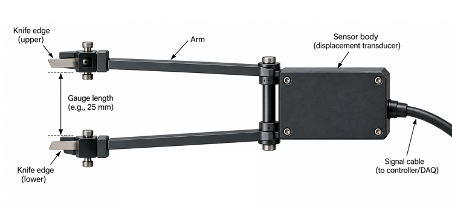

인장시험(Tensile Test)은 재료에 축 방향의 인장 하중을 가하면서 하중과 변형을 측정하는 가장 기본적인 재료시험 중 하나이다. 이 글에서는 범용재료시험기와 신률계를 이용한 일반적인 시험을 기준으로 시험 준비, 데이터 변환, 결과 해석 및 주요 오류의 확인 방법을 지금까지의 경험을 바탕으로 정리한다.

## 1. 인장시험의 개요

인장시험에서는 규정된 형상의 시편을 일정한 속도로 잡아당겨 하중(Load)과 변위 또는 연신량(Displacement or Extension)을 기록한다. 이 데이터와 시편의 초기 치수를 이용하면 다음과 같은 대표적인 기계적 물성을 구할 수 있다.

- **탄성계수(Elastic modulus, Young's modulus)**: 탄성 구간에서 응력 증가량과 변형률 증가량의 비로, 재료의 강성을 나타낸다.
- **인장강도(Tensile strength)**: 시험 중 시편이 견딘 최대 공칭응력이다.
- **항복강도 또는 항복점(Yield strength or yield point)**: 탄성 거동을 벗어나 영구 변형이 시작되는 응력이다. 명확한 항복점이 없는 재료에는 규격에서 정한 오프셋 항복강도를 사용할 수 있다.
- **파단 연신율(Elongation at break)**: 파단 시점의 변형률 또는 초기 표점거리 대비 길이 증가율이다.
- **푸아송비(Poisson's ratio)**: 축 방향 변형률에 대한 가로 방향 변형률의 음의 비이다. 이를 구하려면 보통 가로 방향 신률계, 스트레인 게이지 또는 영상 측정 장치가 추가로 필요하다.

응력-변형률 곡선(Stress–strain curve)은 재료에 작용한 응력과 그에 따른 상대적인 길이 변화를 나타낸다. 일반적인 공칭응력(Engineering stress)과 공칭변형률(Engineering strain)은 다음과 같이 계산한다.

$$
\sigma = \frac{F}{A_0}
$$

$$
\varepsilon = \frac{\Delta L}{L_0}
$$

여기서 $F$는 하중, $A_0$는 시험 전 초기 단면적, $\Delta L$은 표점 구간의 길이 변화, $L_0$는 초기 표점거리(Gauge length)이다. 응력은 주로 MPa, 변형률은 무차원 값 또는 %로 표시한다.

하중-변위 곡선은 시편의 치수뿐 아니라 시험기와 그립의 변형까지 포함하므로 동일 재료라도 시편 형상이나 장비 조건에 따라 달라질 수 있다. 반면 응력-변형률 곡선은 초기 단면적과 표점거리로 정규화하므로 재료 거동을 비교하는 데 더 적합하다.

곡선의 형태는 재료에 따라 다르다. 금속은 선형 탄성 구간 이후 항복과 소성변형을 보이는 경우가 많고, 고분자는 점탄성, 시험 속도 및 온도의 영향을 크게 받을 수 있다. 섬유강화 복합재료는 섬유 방향에서 파단 직전까지 거의 선형으로 거동하기도 하지만, 적층 방향과 손상 방식에 따라 비선형이나 단계적인 하중 저하가 나타날 수 있다.

아래 인터랙티브 그래프에서 영률, 항복강도, 인장강도와 파단변형률을 변경하거나 대표 재료를 선택하면서 응력-변형률 곡선의 변화를 직접 확인할 수 있다.

<!-- interactive:tensile-test -->

*더 넓은 화면에서 곡선을 조정하려면 [응력–변형률 곡선 인터랙티브 데모](/ko/interactive/stress-strain-demo/)를 이용할 수 있다.*

## 2. 인장시험기의 구조 및 원리

범용재료시험기(Universal Testing Machine, UTM)는 시편에 제어된 하중 또는 변위를 가하고 그 반응을 기록하는 장비이다. 일반적인 시험기는 다음 요소로 구성된다.

*그림 1. 범용재료시험기(UTM)를 이용한 인장시험 구성 예시. 단 신률계, 데이터 수집 시스템, 컴퓨터는 나타내지 않은 상태이다.(Modeling: Blender)*

| 구성 요소                     | 역할                                                                                                                                                             |
| ------------------------- | -------------------------------------------------------------------------------------------------------------------------------------------------------------- |
| 하중계(Load cell)            | 시편에 전달되는 인장력을 전기 신호로 변환하여 측정한다. 주로 사용하는 시편에 적합한 용량(Capacity)을 사용해야 하며, 너무 큰 용량을 사용시 분해능(Resolution) 문제로 인하여 그래프가 거칠어지고, 너무 작은 용량을 사용할 경우 하중계가 손상될 위험이 크게 증가한다. |
| 크로스헤드(Crosshead)          | 구동 장치에 의해 이동하며 시편에 변위를 가한다. 보통 시험 속도를 Crosshead speed로 표현한다.                                                                                                   |
| 그립 또는 지그(Grip or fixture) | 시편 양단을 고정하고 하중을 전달한다.                                                                                                                                          |
| 시편(Specimen)              | 규격에 맞게 제작된 시험 대상이다.                                                                                                                                            |
| 신률계(Extensometer)         | 정해진 표점 구간에서 시편의 실제 연신량을 측정한다.                                                                                                                                  |
| 데이터 수집 시스템                | 하중, 위치, 연신량 등의 신호를 시간에 따라 동기화하여 저장한다. 주로 메인바디, 컨트롤러(Controller) 또는 데이터 수집 시스템(DAQ) 및 컴퓨터로 구성되어 있다.                                                             |
| 죠(Jaw)                    | 그립 내부에 있으며 시편에 직접 닿는 요소이다. 닿는 면이 널링(knurling) 처리 되어있어 시편과의 미끄러짐을 최소화하게 되어있으며, 주로 쐐기모양이기 때문에 인장을 하면 할수록 세게 붙잡게 되므로 처음에 너무 세게 잡으면 시편의 그립부가 압축 파손 될 수도 있다.        |

시험을 시작하면 제어기는 설정된 속도에 따라 크로스헤드를 이동시킨다. 하중계는 축 방향 힘을 측정하고, 크로스헤드 위치 센서 또는 엔코더는 이동량을 기록한다. 신률계를 설치한 경우에는 표점 구간의 연신량도 별도 채널로 수집한다.

크로스헤드 변위(Crosshead displacement)는 시편만의 변형이 아니다. 시험기 프레임, 로드 트레인, 그립 및 탭의 탄성변형과 그립 내부 미끄러짐, 초기 유격이 함께 포함될 수 있다. 따라서 특히 탄성계수처럼 초기 기울기에 민감한 값을 계산할 때 크로스헤드 변위를 시편 변형률로 그대로 사용하면 오차가 커질 수 있다.

### 신률계

신률계(Extensometer)는 시편에 두 접점을 두고 그 사이의 길이 변화를 직접 측정한다. 두 측정점 사이의 초기 거리가 표점거리(Gauge length)이며, 측정 연신량을 이 거리로 나누어 변형률을 계산한다. 신률계는 시험기 전체의 변형보다 시편 표점부의 변형을 직접 측정하므로 크로스헤드 변위보다 정확한 탄성계수와 항복 변형률을 얻는 데 유리하다. 

예를 들어 두 접점의 초기 거리가 25mm이고, 인장중에 두 접점이 2mm 벌어졌다면 그 순간의 변형률은 2/25로 계산할 수 있으며, 이 값은 크로스헤드의 이동거리를 시편의 표점거리로 나눈 값보다 더 정확하다.

*신률계의 부위별 명칭. Knife edge가 시편 표면을 정확히 따라갈 수 있도록 사용하는게 핵심이다.*

신률계는 그림과 같이 일정한 간격을 가진 칼날(Knife edge)로 되어있으며, 이 칼날이 시편에 접촉한 상태에서 시편의 변형을 정확하게 따라가는 방식으로 사용된다. 따라서 시험 중 칼날이 미끄러지면 데이터가 쓸모없어진다. 그림에는 표현하지 않았지만, 시편에 부착할 수 있도록 고리나 걸쇠같은게 신률계에 포함되어 있다.

신률계를 사용하지 않을 경우, 크로스헤드의 변위는 무수히 많은 요소의 영향을 받는다. 예를 들어 크로스헤드는 인장시험 중 미세하게 힘을 받아 휘어지며, Guide column은 미세하게 압축된다. 따라서 정교한 변형률을 얻기 위해서는 메인 바디의 데이터에만 의존해서는 안되며, 신률계를 사용하거나 Strain gauge, 변위 측정 카메라 등 다양한 장비를 사용해야 한다.

신률계를 사용할때도 얼마나 정교하게 사용하느냐가 중요하며, 대충 사용할 경우에는 사용하지 아느니 못한 경우가 된다. 인장시험은 가장 간단한 시험 중 하나이지만, 정확한 데이터를 위해서는 시험의 매 순간마다 관찰과 집중이 필요하다. 신률계의 정교한 사용을 위해서는 다음 사항을 확인한다.

- 시편 중심과 표점 구간에 맞추어 좌우 대칭으로 장착한다.
- 접촉 날이나 고정 밴드가 시편을 손상시키거나 미끄러지지 않는지 확인한다. 시험중 미끄러지는 경우가 많으므로, 양쪽면의 거칠기가 다르다면(몰드를 이용하여 성형하는 복합재료의 경우 자주 발생한다) 더 거친 면에 날을 접촉시키는것이 좋다.
- 측정 범위와 허용 변형률이 예상 변형보다 충분한지 확인한다.
- 장착 후 신호가 안정된 상태에서 영점(Zero)을 설정한다.
- 탈착 시 시편과 신률계에 충격을 주지 않도록 하중을 정지하거나 규정된 절차를 따른다.
- 시편이 작거나 강도가 약할경우, 장착된 시편 자체가 모멘트를 가하면서 데이터가 왜곡되는 경우도 있다. 이럴 경우에는 신률계 무게의 영향을 상쇄하기 위한 별도의 조치를 하는 것이 권장된다.(*특별한 방법이 있는 것은 아니다*)

신률계를 파단까지 유지하면 파단 변형률을 직접 측정할 수 있지만, 파단 충격으로 신률계가 손상될 위험이 있다. 예를 들어 칼날간 거리가 40 mm 이상 벌어지면 안되는 제품이라고 가정할 때, 시편이 파손되면서 그 이상으로 벌어지면 내부 센서가 손상될 수 있다. 따라서 시험 규격, 신률계의 이동 범위 및 시편의 파단 양상에 따라 일정 변형률까지 측정한 뒤 제거하고 이후 변형은 다른 방법으로 측정하기도 하며, 최근에는 카메라의 성능이 상향 평준화 됨에 따라 Digital Image Correlation(DIC) 장비를 사용하기도 한다.

### Jaw

Jaw는 그립의 안쪽에 장착하며 시편의 형상이나 두께에 따라 그에 맞는 것을 장착할 수 있게 되어있다. Jaw의 주요 특징 중 하나는 그립부에 쐐기모양으로 장착된다는 것이다. 이 경우 인장시험중 시편에 의해 Jaw가 시편 방향으로 잡아당겨지게 되며, 잘 관찰해보면 Jaw는 더욱 폭이 좁은곳으로 당겨지는셈이 된다. 그에 따라 시편의 접촉부에는 더욱 높은 압축하중이 가해진다. 따라서 처음부터 너무 강한 힘으로 시편을 고정할 필요는 없다.
아래 그림은 인장에 의해 Jaw에서 어떤 응력 및 변형 거동이 발생하는지 구조해석을 통하여 시각적으로 나타낸 것이다.

*Jaw를 잘 관찰하면 그립 표면을 타고 올라가는것을 알 수 있으며, 이때 시편에는 점점 큰 압축력이 작용한다.*

#### 시험기의 정밀도와 신뢰성

신뢰성 있는 시험 결과를 얻기 위해서는 하중 및 변위 측정 정확도뿐만 아니라 시험기 자체의 기계적 완성도 역시 중요하다. 시험기의 프레임 강성(frame stiffness)과 정렬도(alignment)는 측정 결과에 직접적인 영향을 줄 수 있으며, 특히 하중축(load train)의 정렬이 불량한 경우 시편에 의도하지 않은 굽힘 응력이 발생하여 측정 결과에 오차가 포함될 수 있다. 따라서 정밀 재료시험기는 충분한 프레임 강성을 확보하는 동시에 액추에이터, 그립, 시편 및 로드셀로 이어지는 하중축의 정렬을 높은 수준으로 유지할 수 있도록 설계·제작된다. 현업자에게 들은게 정확하게 기억은 나지 않지만 정밀도를 Class로 분류하여 매우 높은 정밀도로 관리하며, 어떤 나사는 돌리는것 자체만으로도 영향을 주기 때문에 함부로 조정해서는 안된다.

이러한 이유로 높은 신뢰성이 요구되는 시험에서는 장비의 단순한 최대 하중 용량이나 표시 분해능만을 비교하기보다는, 재료시험기 제작 및 제어 시스템에 충분한 경험과 기술력을 갖춘 제조사의 장비를 사용하는 것이 권장된다. 장비의 기계적 정밀도뿐만 아니라 로드셀, 변위계, 신률계(extensometer), 제어기(controller) 및 데이터 수집 시스템이 하나의 시스템으로 안정적으로 작동하는지도 중요하다.

장비와 제어 시스템의 성능 차이는 정적 인장시험보다 피로시험과 같이 동적 하중을 인가하는 복잡한 시험에서 더욱 중요해질 수 있다. 동적 시험에서는 하중의 정확한 제어, 응답 속도, 파형 유지, 각종 센서와의 연동 및 실시간 데이터 처리 등이 동시에 요구되기 때문이다.

예를 들어 피로균열진전(fatigue crack growth) 시험에서는 균열 길이를 traveling microscope 등의 광학 장비를 이용하여 직접 측정할 수도 있지만, 적절하게 교정된 고정밀 시스템에서는 COD(Crack Opening Displacement) 또는 균열 개구 변위 게이지로 측정한 compliance와 균열 길이 사이의 관계를 이용하여 균열 길이를 간접적으로 산출하는 옵션도 제공하고 있다. 이를 이용하면 반복하중 시험 중 균열의 성장을 간편하게 연속적으로 추적하고 시험 제어 및 데이터 처리와 연계할 수 있어 시험의 편의성과 자동화 수준을 높일 수 있다.

따라서 재료시험기를 선정할 때에는 단순히 장비의 하중 용량이나 정적 정확도만을 고려하기보다 프레임 강성, 하중축 정렬, 센서 정확도, 제어 성능, 데이터 수집 시스템 및 향후 수행하고자 하는 시험 방법과의 확장성을 종합적으로 고려하는 것이 바람직하다.

## 3. 인장시험 데이터의 분석

원시 데이터(Raw data)는 보통 시간, 하중, 크로스헤드 변위 및 신률계 연신량으로 구성된다. 응력-변형률 곡선을 만드는 기본 순서는 다음과 같다.

1. 시험 전 측정한 폭과 두께로 초기 단면적 $A_0$를 계산한다.
2. 하중 $F$를 $A_0$로 나누어 공칭응력 $\sigma$로 변환한다.
3. 신률계 연신량 $\Delta L$을 초기 표점거리 $L_0$로 나누어 공칭변형률 $\varepsilon$로 변환한다.
	*대부분, 엑셀에서 첫번째 행의 값만 계산한 후 나머지는 자동으로 계산하여 사용한다.
4. 필요한 경우 규격에서 정한 구간과 방법으로 탄성계수, 항복강도, 인장강도 및 파단 변형률을 계산한다.

예를 들어 폭 10 mm, 두께 2 mm인 직사각형 시편에 10 kN의 하중이 작용하면 초기 단면적은 20 mm²이고 공칭응력은 다음과 같다.

$$
\sigma = \frac{10\,000\ \mathrm{N}}{20\ \mathrm{mm^2}} = 500\ \mathrm{MPa}
$$

초기 표점거리 50 mm인 구간이 0.25 mm 늘어났다면 공칭변형률은 $0.25/50=0.005$, 즉 0.5%이다. 폭이나 두께를 잘못 측정하면 모든 응력값에 비례 오차가 생기고, 표점거리를 잘못 입력하면 모든 변형률값이 달라진다. 시편별 치수를 직접 측정하여 기록하는 것이 중요하다.

탄성계수는 탄성 구간의 기울기로 계산한다.

$$
E = \frac{\Delta \sigma}{\Delta \varepsilon}
$$

곡선의 시작점부터 임의로 직선을 맞추기보다는 해당 시험 규격이 지정한 변형률 구간을 사용해야 한다. 초기에는 시편 안착이나 유격 제거에 따른 toe region이 포함될 수 있기 때문이다.

인장강도는 공칭응력의 최댓값으로 구한다. 파단 변형률은 파단 시점의 유효한 변형률 신호 또는 시험 후 표점거리 측정값으로 구하며, 적용 규격에 따라 정의와 측정법이 다를 수 있다. 항복강도 역시 뚜렷한 항복점의 유무에 따라 항복점이나 오프셋법 등 적절한 기준을 선택한다.

데이터 평활화(Smoothing), 시작점 이동 또는 이상값 제거는 원본 데이터를 보존한 상태에서 제한적으로 적용해야 한다. 필터를 과도하게 사용하면 실제 항복, 미세 손상 또는 파단 전 하중 저하가 사라질 수 있다. 보정이 필요하면 적용 목적, 알고리즘, 매개변수 및 처리 전후 데이터를 함께 기록한다.

#### 시험 그래프의 처리 방법

그래프를 그리는 방법은 사람마다 모두 다르며 정확히 정해져 있는 절차가 있는 것도 아니다. 그러나 그래프를 Default 옵션으로 생성한 후 바로 사용하는것은 권장되지 않는다.
아래의 왼쪽 이미지는 응력과 변형률 계산 후 이를 이용하여 그래프를 생성한 직후이다. y축의 끝을 보면 숫자로 끝나지 않으며, 원점도 좌측 하단에 있지 않다. 또한 파손 직후에는 로드셀에서 측정되는 값이 0인데, 이를 그래프에서 연결하면 수직선이 된다.
오른쪽 그래프는 이를 수정한 것이다. 파단점 이후 0으로 떨어지는 직선을 삭제하고 파단 지점을 x로 표시하였다.
그러나 복합재료는 초기 균열개시이후 계단식으로 파단되는 경우도 많은데 이런 경우에는 파단 거동을 보존해야하기 때문에 수직으로 떨어지는 선을 함부로 지우면 안된다.

*응력-변형률 선도(Stress-strain curve) 그린 직후(left) 및 Clean up 후(right). 취성이 높은 소재이기 때문에 기울기가 거의 일정하게 증가하는 거동을 보인다.*

#### Toe region의 예

앞의 예시 그래프에서는 다행이 Toe region이 생기지 않았지만, 많은 시험에서 Toe region이 발생하며, 이를 고려하지 않고 데이터를 처리하는 경우 결과값의 오차가 커지거나 잘못된 탄성계수를 얻게 된다.
Toe region의 원인은 다양하며 몇가지를 나타내면 아래와 같다.
- 그립부 결함(그립과 조의 유격, 미끄러짐, 인장시험 직후 그립력이 느슨해지는 문제 등)
	*개인적으로 많이 겪은 문제이며 주로 발생하는 문제일 것으로 생각한다.
- 시편과 그립의 초기 정렬(settling/alignment)
- 시험기 Compliance
- 시편 결함(복합재료의 경우 인장 초기에 내부의 섬유가 재배열 될 수 있다)

Toe region이 무조건 시험 오류는 아니다. 마지막 예시의 경우 그 재료가 가지는 고유의 거동으로 볼 수 있다.

## 4. 인장시험 시 주의사항

시험 전에는 하중계 용량과 교정 상태, 그립 종류, 시험 속도, 데이터 수집 주기, 시편 치수 및 신률계 범위를 확인한다. 시편은 하중축과 일치하도록 설치하고, 양쪽 그립의 물림 길이와 압력을 일정하게 유지한다. 초기 하중(Preload)과 영점 설정 순서도 시험 규격과 장비 절차에 맞추어 모든 시편에 동일하게 적용한다.

### 대표적인 이상 곡선과 확인 방법

| 관찰되는 현상 | 가능한 원인 | 확인할 사항 및 대응 방법 |
| --- | --- | --- |
| 곡선 초기에 완만하거나 굽은 slack/toe region이 나타남 | 시편 또는 로드 트레인의 유격, 낮은 초기 장력, 그립 내 안착 | 초기 하중과 영점 설정 순서를 확인하고, 그립과 연결부의 유격을 점검한다. 규격이 허용하는 경우에만 toe 보정을 적용한다. |
| 하중은 증가하지만 변형률이 갑자기 크게 증가함 | 시편 미끄러짐, 신률계 접점 이동 | 시편과 그립에 표시를 남겨 상대 이동을 확인하고, 그립 면 상태와 압력을 조정한다. 신률계 고정 상태도 확인한다. |
| 초기 기울기가 예상보다 낮음 | 크로스헤드 변위를 변형률로 사용, 신률계 장착 불량, 장비 컴플라이언스 또는 굽힘 | 변형률 데이터 채널과 표점거리 입력을 확인한다. 신률계를 재장착하고 시편 정렬 및 장비 연결부를 점검한다. |
| 초기 기울기가 비정상적으로 높거나 변형률이 거의 증가하지 않음 | 신률계 고착, 잘못된 변형률 범위 또는 단위, 접점 불량 | 신률계의 자유로운 작동과 교정 상태를 확인하고 채널 배율, 단위 및 표점거리 설정을 검토한다. |
| 응력 또는 변형률 신호가 순간적으로 튀거나 잡음이 큼 | 전기적 노이즈, 느슨한 케이블, 낮은 데이터 품질, 시편 또는 탭의 단계적 손상 | 센서 케이블과 접지를 확인하고 원시 시간 이력을 검토한다. 반복되는 신호인지 실제 손상음이나 외관 변화와 일치하는지 확인한다. |
| 곡선이 반복적으로 꺾이거나 하중이 단계적으로 감소함 | 복합재료의 점진적 손상, 탭 분리, 미끄러짐 또는 센서 문제 | 시편 표면과 탭을 촬영·관찰하고 하중, 변형률 및 영상의 발생 시점을 비교한다. 실제 손상과 계측 오류를 구분한다. |
| 파단 위치가 표점부가 아닌 그립 또는 탭 부근임 | 응력집중, 정렬 불량, 과도한 그립 압력, 탭 형상 또는 접착 불량 | 파단 위치와 양상을 기록하고 물림 길이, 탭 상태, 모서리 손상 및 정렬을 확인한다. 규격의 유효 파단 판정 기준을 적용한다. |
| 동일 조건의 시편 사이에서 응력값 차이가 지나치게 큼 | 폭·두께 측정 오류, 단위 입력 오류, 재료 편차, 하중 전달 차이 | 원시 하중과 입력 단면적을 분리해 비교하고 측정 위치, 측정 기기 및 시편 방향을 재확인한다. |
| 곡선이 매끄럽지만 예상 재료 거동과 전혀 다름 | 잘못된 센서 채널, 단위 또는 시편 정보, 시험 속도·온도 차이, 시편 방향 오류 | 장비 설정과 파일 메타데이터를 원시험 기록과 대조하고 시험 속도, 환경 및 시편 방향을 확인한다. |

그립 압력이 너무 약하면 미끄러지고, 너무 강하면 시편 표면이나 복합재료 탭이 손상되어 그립 부근 조기 파단을 유발할 수 있다. 정렬이 불량하면 인장 하중과 함께 굽힘(Bending)이 발생하므로, 가능하다면 시편 양면 또는 좌우의 변형률을 비교하여 굽힘 정도를 확인한다.

예상과 다른 곡선이 나왔다고 해서 데이터를 즉시 삭제해서는 안 된다. 원시 데이터와 파단 시편을 보존하고, 파단 위치, 미끄러짐 흔적, 시험 설정, 센서 신호 및 작업 기록을 먼저 확인한다. 이후 규격의 유효성 기준에 따라 제외 여부와 이유를 기록해야 한다.

## 5. 심화 과정

기본적인 UTM과 신률계 시험에 다음 측정법이나 환경 제어를 추가하면 더 다양한 기계적 거동을 분석할 수 있다.

- **스트레인 게이지(Strain gauge)**: 시편 표면의 국부 변형률을 측정하며, 여러 방향으로 배치하면 방향별 변형을 비교할 수 있다.
- **푸아송비 측정**: 축 방향과 가로 방향 변형률을 동시에 측정하여 하중 방향에 수직한 수축 거동을 평가한다.
- **디지털 영상 상관법(Digital Image Correlation, DIC)**: 시편 표면 영상을 분석하여 비접촉 방식으로 전 영역 변형률 분포를 구한다.
- **반복 또는 사이클 인장시험(Cyclic tensile test)**: 하중의 반복에 따른 강성 변화, 잔류 변형 및 손상 누적을 관찰한다.
- **고온·저온 인장시험**: 환경 챔버를 이용하여 온도 변화가 강도와 변형 거동에 미치는 영향을 평가한다.
- **복합재료의 방향별 인장시험**: 섬유 방향과 적층 구성에 따른 이방성(Anisotropy)을 비교한다.
- **진응력-진변형률(True stress–true strain)**: 변형 중 변화한 순간 단면적과 길이를 고려한다. 큰 소성변형을 해석할 때 공칭응력-공칭변형률과 구분하여 사용한다.

각 방법은 시편 준비, 계측 구성 및 데이터 처리 기준이 서로 다르므로 목적에 맞는 시험 규격과 절차를 별도로 검토해야 한다. 스트레인 게이지, DIC, 복합재료의 방향별 인장시험과 실제 데이터 분석 방법은 추후 시험 사례와 그림, 원시 데이터를 보완하여 별도의 문서에서 상세히 다룰 예정이다.
