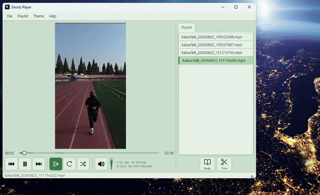
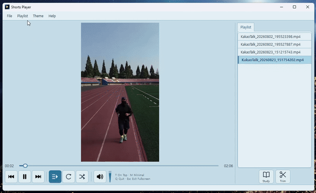
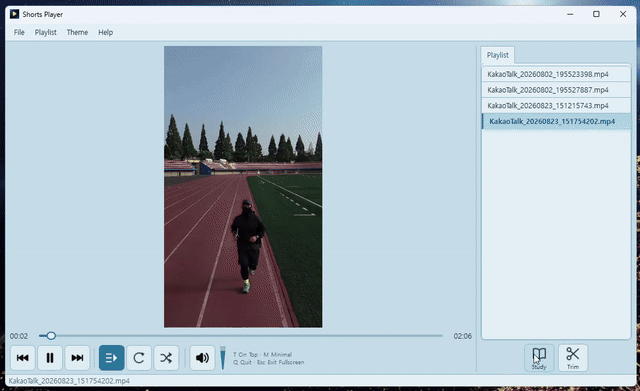
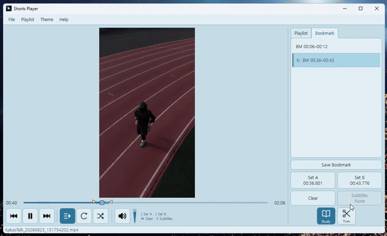
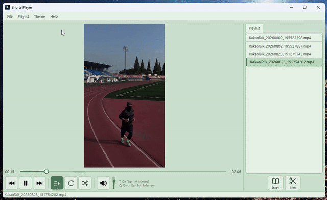

A simple video player built on the open-source FFmpeg and VLC frameworks.

Shorts Player v1.0.0 is distributed as a ZIP archive through the official DrLeeWorks GitHub Releases repository.

## Usage Examples

### 1) Responsive Interface

The player interface automatically adjusts to the window size.

### 2) Save Playlists

Save playlists and load them again whenever you need them.

### 3) Multiple Repeat Sections and Bookmarks

Save multiple A-B repeat sections and bookmarks to support video-based learning.

### 4) Trim Videos

Select a section or specific frames to export as a video clip. You can also save the selection as a GIF.

### 5) Four Themes

Choose from four themes: Light, Dark, Sky, and Green.

### 6) Other Features

- Always on Top keeps the player above other windows (T).
- Minimal Mode displays only the video (M).
- Multiple subtitle tracks are detected, allowing you to cycle through the available languages with a click.
- Key shortcuts for each mode appear in small text to the right of the volume control.
